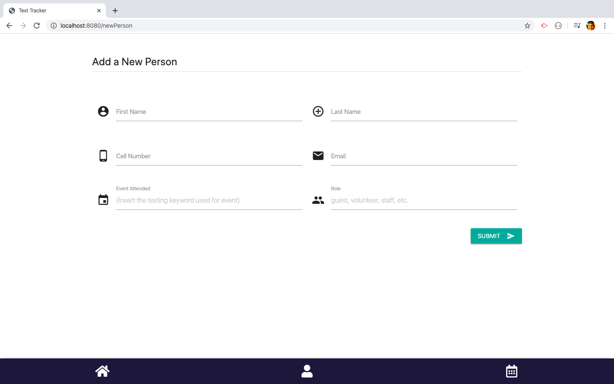
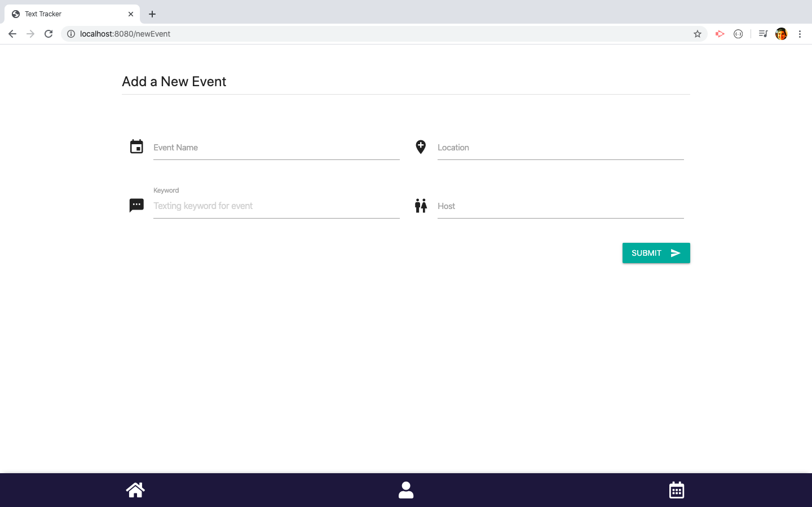

# Make Me Laugh!

## Elevator Pitch

"Text Tracker" is an application designed for allowing users to track event attendance. It utilizes clearstream.io, a communications service which maintains and updates information via a webhook. In Text Tracker, clearstream's webhook works in conjuction with a MySQL database, as well as front-end webpages, to provide a full-stack platform. 

When someone attending an event wishes to check in, they text a code word affiliated with that specific event to a clearstream phone number. As a result of this, the attendee's first name, last name, and mobile number are automatically pushed from clearstream's webhook to Text Tracker's MySQL database without the need for making an API call. Because of this automated process, event hosts DO NOT need to manually sort through each and every incoming text in order to keep track of who did or did not check into an event. Rather, they can refer to the information in Text Tracker's MySQL database, which automatically receives data from the clearstream.io webhook.

Additionally, the front-end Text Tracker website allows users to manage information with ease. Hosts and event managers can input information for a new upcoming event (the event name, keyword and location) <http://localhost:8080/newEvent>, and attendees can initialize their personal information (name, email and cell number) <http://localhost:8080/newPerson>. In both these instances, the information submitted via the user-end is stored in Text Tracker's MySQL database.

More information about clearsteam.io can be found here <https://clearstream.io/>, and information about webhooks vs. APIs can be found here https://sendgrid.com/blog/webhook-vs-api-whats-difference/

## User Story:
AS AN   event manager, 

I WANT TO    use an application which AUTOMATES the storage of incoming information,

SO I CAN    not have to manually sift through it and input each new record.
 

## Process   

New Technologies:
- clearstream.io (webhook) <https://clearstream.io/>

CSS libraries:
- Materialize <https://materializecss.com/>

Object-Relational Mapping tools:
- Sequelize <https://sequelize.org/>

Databases:
- MySQL <https://www.mysql.com/>

Database workbench:
- DBeaver <https://dbeaver.io/>

#### Overcoming Challenges

Getting the server-side of our application to work in conjuction with the front-end was a challenge. Establishing API routes and HTML routes took repeated effort and revision in order to achieve working code.

It was a little difficult to associate users to events, and to get the routes to return both users and events with matching keywords.

Additionally, we had some challenges with the database. At first, getting good dummy data that would properly feed into our tables and fit our
criteria was an obstacle. 

Another problem we faced with the database was an error we had because we had created the tables manually, and it was conflicting with Sequelize as it tried to create the tables via the models. 

#### Successes

Through persistant trial and error, we were able to successfully (1) get the user-end webpages to work, (2) get the server-side databases and routes to work, and (3) get the user-end and server-side to work in conjunction with each-other. 

Additionally, we were able to successfully deploy our application's server to Heroku, and manage its settings within Heroku so that each push made to our Github repository re-deployed the server. (This saved us the time of having to manually re-deploy our application to Heroku whenever we made changes to it.)

## Demo

## Directions for Future Development

  
## Links

GH pages: <https://pmahalan.github.io/Project_2/>

GH repository: <https://github.com/pmahalan/Project_2>